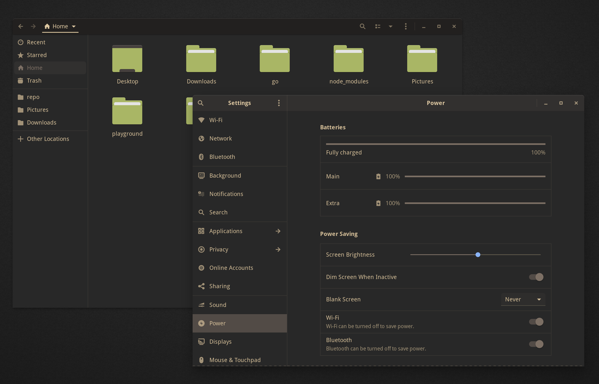

This theme is a port of [sainnhe/gruvbox-material](https://github.com/sainnhe/gruvbox-material), currently support GTK, Gnome, Cinnamon, XFCE, Unity, Plank and Icons.

## Installation

### Requirements

- GTK >= 3.18
- Murrine engine — The package name depends on the distro.
    - `gtk-engine-murrine` on Arch Linux
    - `gtk-murrine-engine` on Fedora
    - `gtk2-engine-murrine` on openSUSE
    - `gtk2-engines-murrine` on Debian, Ubuntu, etc.

### Manually Installation

1. Clone this repository.
2. Copy `/path/to/gruvbox-material-gtk/themes/*` to `~/.themes/`
3. Copy `/path/to/gruvbox-material-gtk/icons/*` to `~/.icons/`

## Credits

- This theme is generated by [themix-project/oomox](https://github.com/themix-project/oomox).
- The gtk theme is based on [nana-4/materia-theme](https://github.com/nana-4/materia-theme).
- The icon theme is based on [PapirusDevelopmentTeam/papirus-icon-theme](https://github.com/PapirusDevelopmentTeam/papirus-icon-theme).
- Colors are based on [sainnhe/gruvbox-material](https://github.com/sainnhe/gruvbox-material).

## License

[MIT](./LICENSE)
